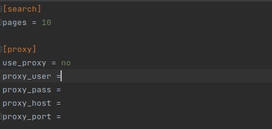
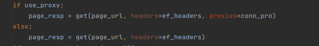
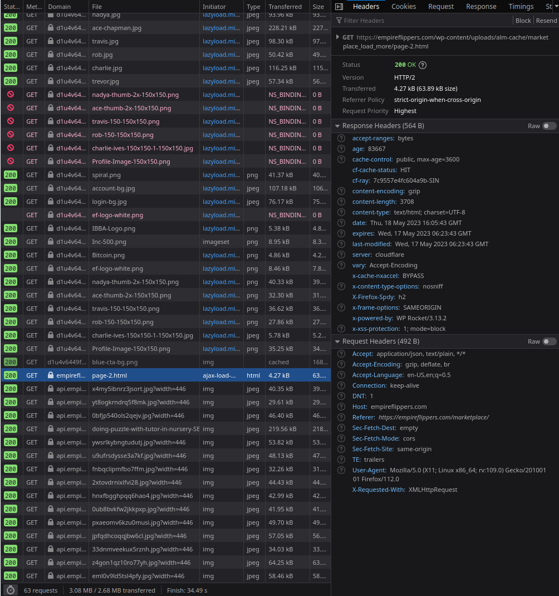
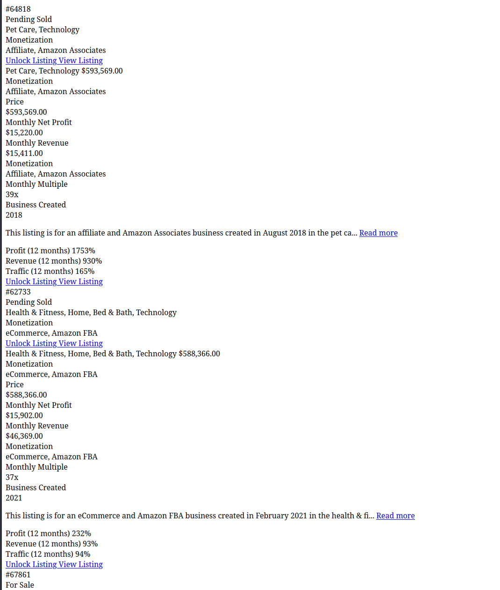
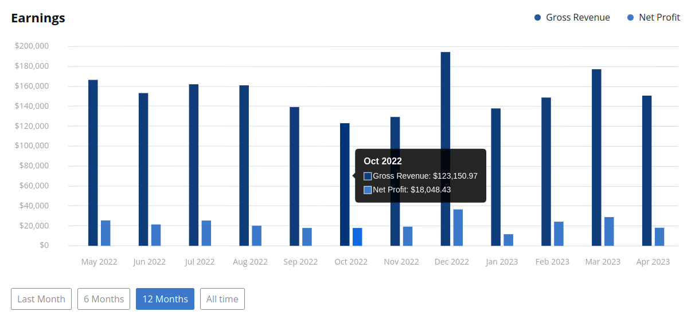
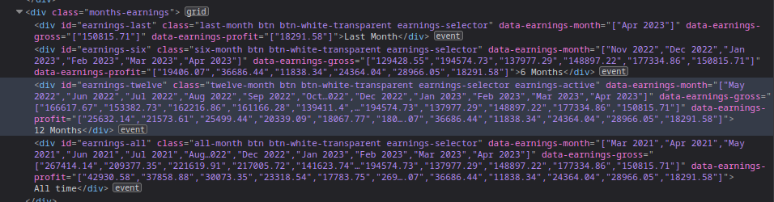
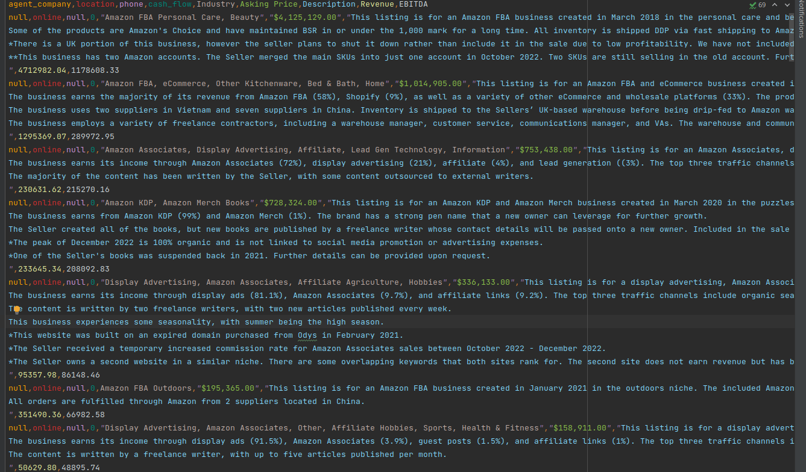

# Fast Scraper
Scrapes Empire Flippers for listing data and saves data as csv.

This script is a demonstration of drastically reducing scraping times with careful observation of how the site works and avoiding Selenium automation entirely.

# Problem Statement
Scrape empireflippers.com, implement the use of proxies and get all the data in the page, including listings that appear only after clicking a 'load more' button.

## Proxies
The script allows configuring a proxy with the provided configurations 
### Set proxy 
You can set a proxy by entering the appropriate proxy username, password, url and port that is provided by your proxy provider. These are standard and a prt of every proxy service no matter who is supplying it.

### Implementation
The config values are implemted this way 

## Avoiding Selenium
Some sites only check the user agent for compatibility and can therefore be exploited to connect to websites without automating a browser by explicitly setting a valid user agent on the headers. This method will not work for sites with a higher level of security.

## Dealing with 'load more' buttons
Studying the site on the Firefox/Chromium webconsole, you notice clicking the 'load more' button triggers an Ajax event that sends a request to a separate url

The urls it uses is in a pattern with a page number in it which can be easily incremented for each page. The response from the url looks like this

This is exploited by directly accessing the urls, and now we can scrape the index page and every subsequent click of the 'load more' button without ever initiating a browser automation, thereby reducing scraping times.

## Scraping data from visual elements in page
Individual pages of each listing contains a bar graph. The problem statement requires switching the range of the graph by pressing a button, gathering the value at each bar that's shown by hovering the mouse over it and then calculating its sum.

Fortunatly the simplicity of the page's layout can be used to our advantage and the chart data can be scraped once again without automating any browser interactions.

By studying the html sturucture of the graph, specifically the buttons to change the ranges, The list of x and y coordinates are part of the button tag, meant to be used by the chatjs plugin.

As you can see the button element has the x and y coordinates for the data on the graph, this data can be scraped directly without ever requiring automation of hovering a mouse over the graph elements.

# Conclusion
Total time taken for a single scrape: 156 seconds

Sample output:

